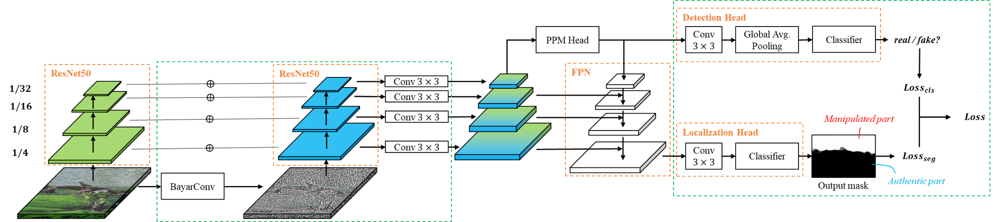
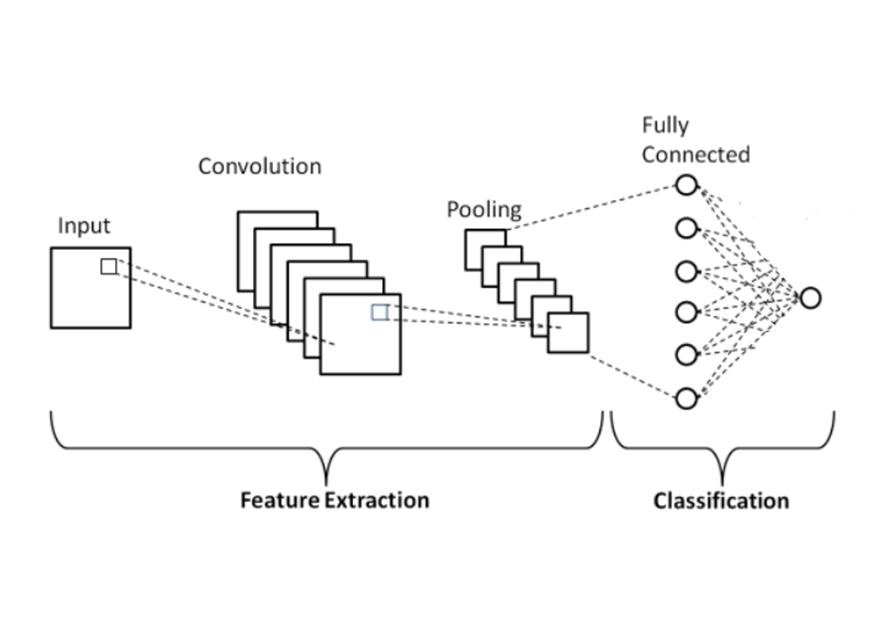

# Shallow- and Deep-fake Image Manipulation Localization Using Deep Learning

## Datasets

### Deepfakes

The deepfake dataset we constructed in Section II.C of our paper can be downloaded [here](https://www.dropbox.com/s/o5410tl5v4vxsth/ICNC2023-Deepfakes.tar.xz?dl=0).

### Shallowfakes

Shallowfake dataset used in our paper can be downloaded individually via the following links:

- [CASIAv2](https://github.com/namtpham/casia2groundtruth)
- [CASIAv1](https://github.com/namtpham/casia1groundtruth)
- [Columbia](https://www.ee.columbia.edu/ln/dvmm/downloads/authsplcuncmp/)
- [COVERAGE](https://github.com/wenbihan/coverage)

### Train/Val/Test Subsets

The format of each line in these files is as the following. For authentic images, `/path/to/mask.png` and `/path/to/egde.png` are set to string `None`. We use digit `0` to represent authentic images, and `1` to represent manipulated images.

```
/path/to/image.png /path/to/mask.png /path/to/egde.png 0/1
```

### backbone model achitectore :



#### download model :

<a href="https://www.dropbox.com/s/zzk4eump5xfbqmz/9.pth?dl=0">backbone</a>

### ore Custem Classifier :



#### download model :

<a href="https://www.dropbox.com/">Classifier</a>

## Usage


### Training

Run the following code to train the network.

For the option `--model`, to reproduce experiments in Table III of our paper:

```
python -u train_ISIMA_Model.py --train_path /path/to/train.txt --target_part seg --load_path_main /path/to/trained/backbonemodel.path --train_target {"seg", "cls"}
```

### Testing

Run the following code to evaluate the network.

```
python -u evaluate.py --paths_file /path/to/test.txt --load_path_cls /path/to/trained/classifier.path --load_path /path/to/trained/backbonemodel.path --model ISIMA
```
